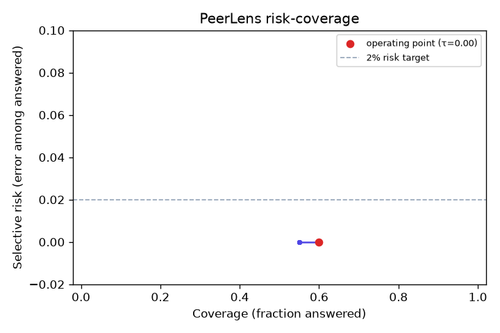

# PeerLens — The Grounded Insights Agent

[](https://huggingface.co/spaces/AkshAt3114/peerlens)

A natural-language insights agent over public U.S. higher-education data that is
**correct or silent, never confidently wrong.** Every number in an answer is
computed by SQL over a clean warehouse and injected programmatically; the
language model never emits a figure of its own. When the system is not confident
the answer is right, it **abstains or asks a clarifying question instead of
guessing.**

The headline metric is not accuracy alone — it is the rate of *confident-and-wrong*
answers, driven toward zero.

> Status: **Phases 1–4 complete.** Live eval (see Results): **0% confident-wrong,
> 100% abstention recall** on a 20-question gold set (`gemini-2.5-flash`). The
> correct-or-silent agent is in (plan contract, schema linking, template-first SQL,
> self-consistency, abstention, programmatic number injection). See [docs/agent.md](docs/agent.md),
> [docs/methodology.md](docs/methodology.md), and
> [docs/evaluation.md](docs/evaluation.md).

## Architecture (target)

```
Urban Institute IPEDS API ─┐
College Scorecard API ──────┼─▶ ingest (httpx + parquet cache)
                            │
                            ▼
                 DuckDB star schema  ──▶  data-quality gate (fails build on violations)
                 dim_institution / dim_year
                 fact_admissions_funnel / fact_retention
                 bridge_peer_set (Mahalanobis k-NN peers + aspirants)
                            │
                            ▼
        Agent pipeline (correct-or-silent)
        plan contract (Pydantic) → schema linking → template-first SQL
        → execution-guided correction → N-sample self-consistency
        → abstention decision → programmatic number injection
                            │
                            ▼
                 Streamlit: answer + confidence + the query behind it
```

## Design notes (research-grounded)

Borrowed: schema linking (not whole-schema dumping), constrained generation into a
validated plan before SQL, template-first SQL, execution-guided self-correction,
self-consistency as a confidence signal (CSC-SQL style), programmatic number injection.

Deliberately dropped (restraint is the point): no RL fine-tuning, no multi-agent
swarm, no vector DB for schema linking (the schema is small).

## Results

Generated by the evaluation harness (`peerlens eval`); see
[docs/agent.md](docs/agent.md) for the method.

<!-- EVAL:START -->
**Eval set:** 20 questions (12 answerable, 8 unanswerable). Each scored over self-consistency samples; the threshold τ is swept analytically.

**Operating point (selective risk ≤ 2%): τ = 0.00**

| Metric | At τ = 0.00 (chosen) | At τ = 0.60 (default) |
|---|---|---|
| Coverage (answered) | 60.0% | 55.0% |
| **Confident-wrong rate** | **0.0%** | 0.0% |
| Selective risk (error among answered) | 0.0% | 0.0% |
| Execution accuracy (EX) | 100.0% | 100.0% |
| Abstention recall | 100.0% | 100.0% |
| Over-abstention | 0.0% | 8.3% |


<!-- EVAL:END -->

_Numbers above: `gemini-2.5-flash`, 2 self-consistency samples per question._

### What the eval caught — and fixed

The harness earned its keep. The first full run scored **15–20% confident-wrong**
— concentrated entirely on **out-of-scope** questions (graduation rate, SAT,
tuition, a year we don't hold). The deterministic resolver already had the right
guards (`unknown_metric`, `out_of_scope`), but the **plan prompt forced the model
to pick an in-menu metric**, so "graduation rate" was silently laundered into
`retention_rate` and answered confidently — at 1.00 agreement, so self-consistency
couldn't catch it.

The fix is a prompt change, not a contract change: the model now **names the
metric and year the question actually asks for**, so an unsupported one reaches
the resolver and abstains deterministically. Result:

| | Confident-wrong | Abstention recall |
|---|---|---|
| Before | 15–20% | 50–62% |
| **After** | **0.0%** | **100%** |

A small reminder that the grounding work belongs in deterministic code; the
model's job is to surface intent faithfully, not to force a fit.

## Build order

- **Phase 1** ✅ — Ingest one IPEDS year → DuckDB dims + facts → templated comparison
  query → minimal page. Runnable end to end.
- **Phase 2** ✅ — Mahalanobis peer/aspirant sets (`bridge_peer_set`), retention
  cohorts, and a data-quality gate that fails the build on violations.
- **Phase 3** ✅ — The agent: plan contract, schema linking, template-first SQL,
  execution, N-sample self-consistency, the correct-or-silent decision, and
  programmatic number injection. Gemini provider (REST); fully tested offline.
- **Phase 4** ✅ — Evaluation harness, metrics, risk-coverage sweep + operating-point
  picker, and CI ([docs/evaluation.md](docs/evaluation.md)). Live numbers in the
  Results section above (`peerlens eval`); **[live demo on HF Spaces](https://huggingface.co/spaces/AkshAt3114/peerlens)**.
  Remaining: Scorecard/Pell augmentation, architecture diagram, MARKETview-stack mapping.

## Setup

```sh
uv sync                 # create venv + install deps (Python 3.11+)
cp .env.example .env    # IPEDS needs none; set GEMINI_API_KEY to use the agent
make pipeline           # ingest -> build (with DQ gate) -> Mahalanobis peers
make test               # 51 tests (agent fully tested offline, no key needed)

# the agent (needs GEMINI_API_KEY; free key at https://aistudio.google.com/apikey)
uv run peerlens ask "How does UVA's retention compare to its peers?"
make app                # Streamlit page with the Ask panel + comparison tool
```

## Tech stack

Python 3.11+, httpx, polars, DuckDB, scikit-learn, Pydantic v2, FastAPI,
LangGraph + LangChain, Streamlit, pytest, GitHub Actions. Provider-swappable model
layer (Gemini, local Ollama, Claude).
