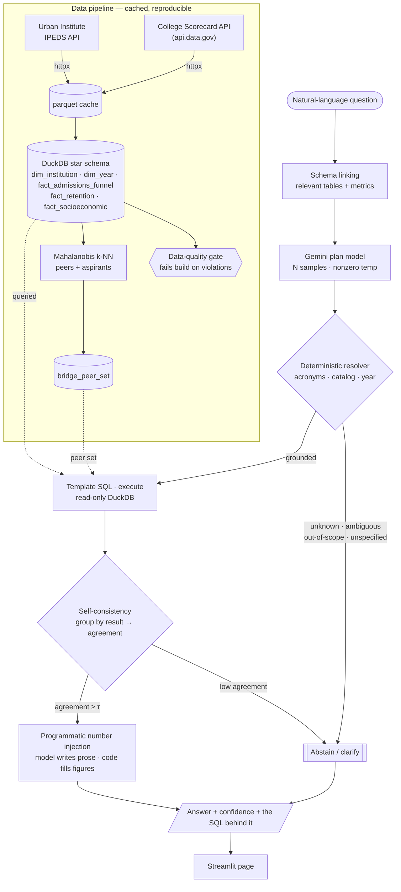

# PeerLens — The Grounded Insights Agent

[](https://huggingface.co/spaces/AkshAt3114/peerlens)

A natural-language insights agent over public U.S. higher-education data that is
**correct or silent, never confidently wrong.** Every number in an answer is
computed by SQL over a clean warehouse and injected programmatically; the
language model never emits a figure of its own. When the system is not confident
the answer is right, it **abstains or asks a clarifying question instead of
guessing.**

The headline metric is not accuracy alone — it is the rate of *confident-and-wrong*
answers, driven toward zero.

> Status: **Phases 1–4 complete.** Live eval (see Results): **0% confident-wrong,
> 100% abstention recall** on a 20-question gold set (`gemini-2.5-flash`). The
> correct-or-silent agent is in (plan contract, schema linking, template-first SQL,
> self-consistency, abstention, programmatic number injection). See [docs/agent.md](docs/agent.md),
> [docs/methodology.md](docs/methodology.md), and
> [docs/evaluation.md](docs/evaluation.md).

## Architecture



Every answer is either **grounded** — a real number computed by SQL, with the
query shown — or an **abstention / clarifying question**; the model never emits a
figure of its own. The evaluation harness (see [Results](#results)) runs this same
agent over a gold set to measure the confident-wrong rate. Deep dives:
[docs/agent.md](docs/agent.md), [docs/methodology.md](docs/methodology.md),
[docs/evaluation.md](docs/evaluation.md).

## Design notes (research-grounded)

Borrowed: schema linking (not whole-schema dumping), constrained generation into a
validated plan before SQL, template-first SQL, execution-guided self-correction,
self-consistency as a confidence signal (CSC-SQL style), programmatic number injection.

Deliberately dropped (restraint is the point): no RL fine-tuning, no multi-agent
swarm, no vector DB for schema linking (the schema is small).

## Results

Generated by the evaluation harness (`peerlens eval`); see
[docs/agent.md](docs/agent.md) for the method.

<!-- EVAL:START -->
**Eval set:** 20 questions (12 answerable, 8 unanswerable). Each scored over self-consistency samples; the threshold τ is swept analytically.

**Operating point (selective risk ≤ 2%): τ = 0.00**

| Metric | At τ = 0.00 (chosen) | At τ = 0.60 (default) |
|---|---|---|
| Coverage (answered) | 60.0% | 55.0% |
| **Confident-wrong rate** | **0.0%** | 0.0% |
| Selective risk (error among answered) | 0.0% | 0.0% |
| Execution accuracy (EX) | 100.0% | 100.0% |
| Abstention recall | 100.0% | 100.0% |
| Over-abstention | 0.0% | 8.3% |


<!-- EVAL:END -->

_Numbers above: `gemini-2.5-flash`, 2 self-consistency samples per question._

### What the eval caught — and fixed

The harness earned its keep. The first full run scored **15–20% confident-wrong**
— concentrated entirely on **out-of-scope** questions (graduation rate, SAT,
tuition, a year we don't hold). The deterministic resolver already had the right
guards (`unknown_metric`, `out_of_scope`), but the **plan prompt forced the model
to pick an in-menu metric**, so "graduation rate" was silently laundered into
`retention_rate` and answered confidently — at 1.00 agreement, so self-consistency
couldn't catch it.

The fix is a prompt change, not a contract change: the model now **names the
metric and year the question actually asks for**, so an unsupported one reaches
the resolver and abstains deterministically. Result:

| | Confident-wrong | Abstention recall |
|---|---|---|
| Before | 15–20% | 50–62% |
| **After** | **0.0%** | **100%** |

A small reminder that the grounding work belongs in deterministic code; the
model's job is to surface intent faithfully, not to force a fit.

## From PoC to MARK — mapping onto MARKETview's stack

PeerLens is deliberately a thin local slice, but every layer maps onto a production
stack like MARKETview's — the design choices were made *for* that scale, not just for
this PoC.

| PeerLens (local PoC) | Production equivalent (MARKETview / Azure) | Why the choice carries over |
|---|---|---|
| Ingest: IPEDS + Scorecard via httpx → parquet cache | Azure Data Factory / Databricks ingestion into ADLS + Delta | Idempotent, cached pulls keep everything reproducible; the cache boundary is identical — just orchestrated and bigger |
| Warehouse: DuckDB star schema (dims / facts / bridge) | Azure SQL / Synapse / Databricks SQL (Delta) | Same dimensional model; DuckDB is the local stand-in, and the read-only query path the agent uses is unchanged |
| Transforms + data-quality gate (fails the build on a bad number) | dbt / Databricks jobs with tests, wired into CI | "Fail the pipeline on a referential-integrity or range violation" is what keeps a bad number out of an answer — it scales straight into their orchestration |
| Mahalanobis peer/aspirant sets → `bridge_peer_set` | A scheduled Spark/Databricks feature job materializing the same bridge table | Principled, reproducible comparison sets (the nearest-neighbor idea NCES itself uses on IPEDS) — recompute at full scale |
| The correct-or-silent agent | **MARK itself** | Schema linking, the validated plan contract, template-first SQL, self-consistency, and programmatic number injection are exactly what an AI insights analyst needs to be trustworthy |
| Streamlit "answer + confidence + SQL" | MARK's product surface | Presentation only — but "always show the query" is the trust pattern worth keeping |
| Eval harness in CI (confident-wrong rate, risk-coverage τ-sweep) | A continuous guardrail tracking MARK's confident-wrong rate and operating point | The credibility multiplier: it turns "the demo looked good" into "wrong on under X% of answered questions, abstains on the rest" |

**Schema linking matters *more* at your scale, not less.** Here the schema is tiny, so
retrieving only the relevant tables/columns per question is easy — but it's built that
way on purpose, because whole-schema dumping is the failure mode of off-the-shelf
text-to-SQL (it blows the context window and generalizes poorly). On a large MARKETview
schema, schema linking plus a plan contract validated against the data catalog is what
catches an unknown table or metric **deterministically, before any SQL is generated**.

**Why this shape fits MARK.** MARK's core risk is a confident wrong number driving a
real enrollment or financial-aid decision. This architecture makes that structurally
hard: every figure is computed by SQL and injected by code (the model never writes a
number), anything unknown / ambiguous / out-of-scope abstains or asks a clarifying
question, and self-consistency converts low confidence into an abstention rather than a
guess. The eval harness then *measures* the residual confident-wrong rate and lets you
choose the operating point — the contract a firm needs before an AI analyst goes near a
real decision.

## Build order

- **Phase 1** ✅ — Ingest one IPEDS year → DuckDB dims + facts → templated comparison
  query → minimal page. Runnable end to end.
- **Phase 2** ✅ — Mahalanobis peer/aspirant sets (`bridge_peer_set`), retention
  cohorts, and a data-quality gate that fails the build on violations.
- **Phase 3** ✅ — The agent: plan contract, schema linking, template-first SQL,
  execution, N-sample self-consistency, the correct-or-silent decision, and
  programmatic number injection. Gemini provider (REST); fully tested offline.
- **Phase 4** ✅ — Evaluation harness, metrics, risk-coverage sweep + operating-point
  picker, and CI ([docs/evaluation.md](docs/evaluation.md)). Live numbers in the
  Results section above (`peerlens eval`); **[live demo on HF Spaces](https://huggingface.co/spaces/AkshAt3114/peerlens)**.
  College Scorecard augmentation adds net price, Pell share, and median earnings as
  queryable metrics and a Pell peer-feature (set `SCORECARD_API_KEY` to ingest).

## Setup

```sh
uv sync                 # create venv + install deps (Python 3.11+)
cp .env.example .env    # IPEDS needs none; set GEMINI_API_KEY to use the agent
make pipeline           # ingest -> build (with DQ gate) -> Mahalanobis peers
make test               # 51 tests (agent fully tested offline, no key needed)

# the agent (needs GEMINI_API_KEY; free key at https://aistudio.google.com/apikey)
uv run peerlens ask "How does UVA's retention compare to its peers?"
make app                # Streamlit page with the Ask panel + comparison tool
```

## Tech stack

Python 3.11+, httpx, polars, DuckDB, scikit-learn, Pydantic v2, FastAPI,
LangGraph + LangChain, Streamlit, pytest, GitHub Actions. Provider-swappable model
layer (Gemini, local Ollama, Claude).
